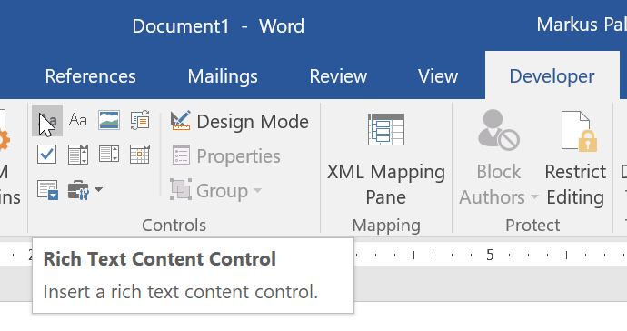
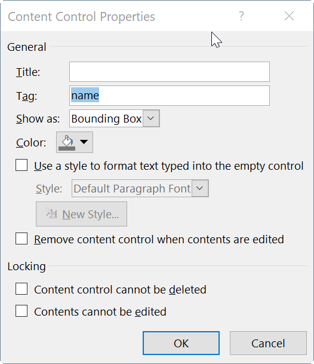
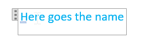

# Readme

## Overview

This library allow you to easily generate .docx files (Office Open XML) based on templates created with Microsoft Word.

It is based on original work by Eric White: Based on https://msdn.microsoft.com/en-us/magazine/ee532473.aspx

Licensed under  the MS-PL license.

## Features

### Placeholders

Let's say you want to generate a document that contains your name. To do that, insert a "Rich Text Content Control" into your template:



If you can't see the `Developer` tab, go to `Options`, `Customize Ribbon` and select the tab there.

Select the placeholder, Click `Properties` and enter the name you want to give your placeholder in the `tag` field. Choosing the name is up to you, the name is relevant because it's how you refer to the placeholder later in code:



You can enter an example value in the placeholder title so that it becomes clear what the placeholder is there for:



Placeholders can be formatted just like normal text. Enabling the "Design mode" makes it easier to spot all the placeholders in a document.

Now let's create a small program that creates a document based on this simple template. First, reference the library and create a `Content` object that describes the content of the placeholders:

```C#
 var content = new Content(
   new FieldContent("name", "Full name", "John Doe")
);
```
Then, load the template and fill the placeholders and save the resulting document to disk:

```C#
using (var fs = File.OpenRead("Template.docx"))
using (var ms = new MemoryStream())
    fs.CopyTo(ms);
    var templateProcessor = new TemplateProcessor(ms);
    templateProcessor.FillContent(content);

    File.WriteAllBytes("Document.docx", ms.ToArray());
}
```

You have now successfully created your first Word document with dynamic values!

### Tables placeholders

tbd

### Conditional placeholders

tbd

### Metadata

tbd
